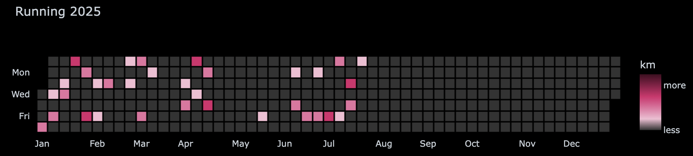

![A heatmap chart titled Running 2025 showing running activity throughout the year. The chart displays days of the week on the left (Mon, Wed, Fri) and months along the bottom from January to December. Colored squares indicate running distance, with darker shades representing more kilometers and lighter shades representing fewer kilometers. A color legend on the right explains the gradient from less to more kilometers. Most activity is concentrated in the first half of the year, with little or no activity shown from August to December. The overall tone is neutral and informative.](runbox-chart.png)

